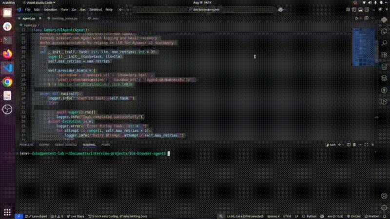
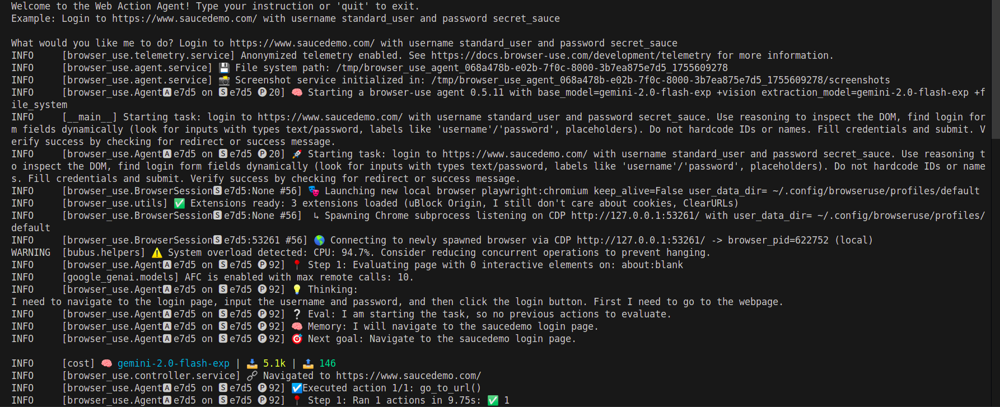

## Setup Instructions
Follow these steps to set up and run the project locally:

Clone the Repository
- git clone git@github.com:Brandonawan/llm-browser-agent.git
- cd llm-browser-agent.git
- Create a .env file in the root directory and add your GOOGLE API key:
  ```
  GOOGLE_API_KEY=your_google_api_key_here
  ```
Create and Activate Virtual Environment
- python -m venv env
- source env/bin/activate  # on linux

## Install Dependencies
- Ensure Python 3.10+ is installed, then:
- pip install -r requirements.txt

## Run commands
```bash
python3 agent.py
```

## Recording of code execution
- The code execution is recorded and can be viewed here:


## Terminal Output
- Below is the automation terminal logs.

